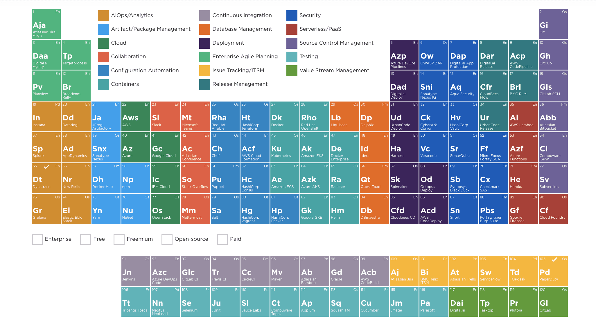

title: CICD
author:
  name: Fazreil Amreen
  twitter: fab52
  url: https://www.linkedin.com/in/ts-fazreil-amreen-abdul-jalil-a0259321
output: index.html
controls: true

--

# CICD:
## The Agile Release ([Silver] Bullet) Train

--

# who/what is DevOps?

--

- DevOps is a culture, a practise.
- But like Agile Coaches, you have DevOps engineers to cultivate the culture.

--

# DevOps do what actually?

--

- Connect between Development and Operations
- Build pipeline
- Enhance build by probing it
- Shift left operations into development stage

---

# Pipeline Design

--

- How does the DevOps choose what program to use?
- How does the DevOps design the pipeline?
- What criteria does the DevOps have in mind when it comes to design the pipeline?
- Pipeline, what pipeline?

--

### The DevOps Periodic Table

I usually use this table to decide what to put in the pipeline

--

### Tools

<video control >
  <source src ="videos/tools.avi"/>
</video>

--

### The DevOps utopia

- the tools
- the process
- the people

--

#### The DevOps Utopia: The tools

 put the devops process flaw here

--

#### The DevOps Utopia: The process

put pr process here

--

#### The DevOps Utopia: The people

put safe 6.0 here

--

# The cult of DevOps

--

- what makes a good DevOps guy?
- how many DevOps should a team has?
- is the DevOps guy also the infra guy?

--

### devops guy
put devops burger here

--

### devops guy
- make fun of the devs
- also make fun of the ops (infra)
- devops can do both
- one day they may also have management skills
- 

--

### 

---

# Q&A

---

# Thank you
