title: CICD
author:
  name: Fazreil Amreen
  twitter: fab52
  url: https://www.linkedin.com/in/ts-fazreil-amreen-abdul-jalil-a0259321
output: index.html
controls: true
theme: sudodoki/reveal-cleaver-theme

--

# for Nazmi

--

# CICD:
## The Agile Release ([Silver] Bullet) Train

--

# who/what is DevOps?

--


--

- DevOps is a culture, a practise.
- But like Agile Coaches, you have DevOps engineers to cultivate the culture.

--

# DevOps do what actually?

--

- Connect between Development and Operations
- Build pipeline
- Enhance build by probing it
- Shift left operations into development stage

---

# Pipeline Design

--

- How does the DevOps choose what program to use?
- How does the DevOps design the pipeline?
- What criteria does the DevOps have in mind when it comes to design the pipeline?
- Pipeline, what pipeline?

--

### The DevOps Periodic Table


I usually use this table to decide what to put in the pipeline

--

### Tools

<video control width="100%" height="100%" autoplay=true loop=true>
  <source src ="videos/tools.webm"/>
</video>

--

# The Agile Release Train
## Yes the previous slides were just mere introduction

--

### Agile Release Train

The Agile Release Train (ART) is a long-lived team of Agile teams that incrementally develops, delivers, and often operates one or more solutions in a development value stream.

```
© Scaled Agile, Inc.
Include this copyright notice with the copied content.
```

--

### Agile Release Train

From the definition, ART consists of Agile team that do these:
<table>
  <tr>
    <td>
      <ul> develop
        <li> code </li>
        <li> build </li>
        <li> test </li>
      </ul>
    </td>
    <td style='text-align:center; vertical-align:middle'>  </td>
    <td>
      <ul> deliver
        <li> deploy </li>
        <li> operate </li>
        <li> monitor </li>
      </ul>
    </td>
  </tr>
</table>

--

### Agile Release Train

- DevOps glues together the component in Agile teams.
- This is done by automating the connections between each of the components

--

# When shall I implement ART?

--

### Agile X DevOps

ref: [A Disciplined Approach to Adopting Agile Practices: The Agile Adoption Framework](https://www.researchgate.net/publication/225141527_A_Disciplined_Approach_to_Adopting_Agile_Practices_The_Agile_Adoption_Framework)

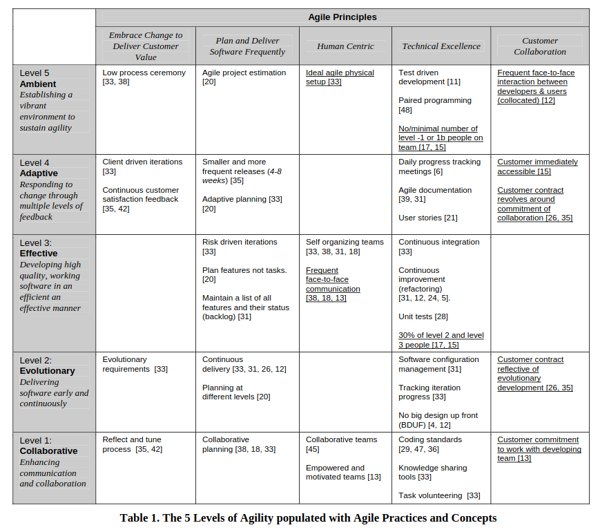

--

### The DevOps utopia

<video control width="100%" height="100%" autoplay=true loop=true>
  <source src ="videos/ppt.webm"/>
</video>

--

#### The DevOps Utopia: The tools

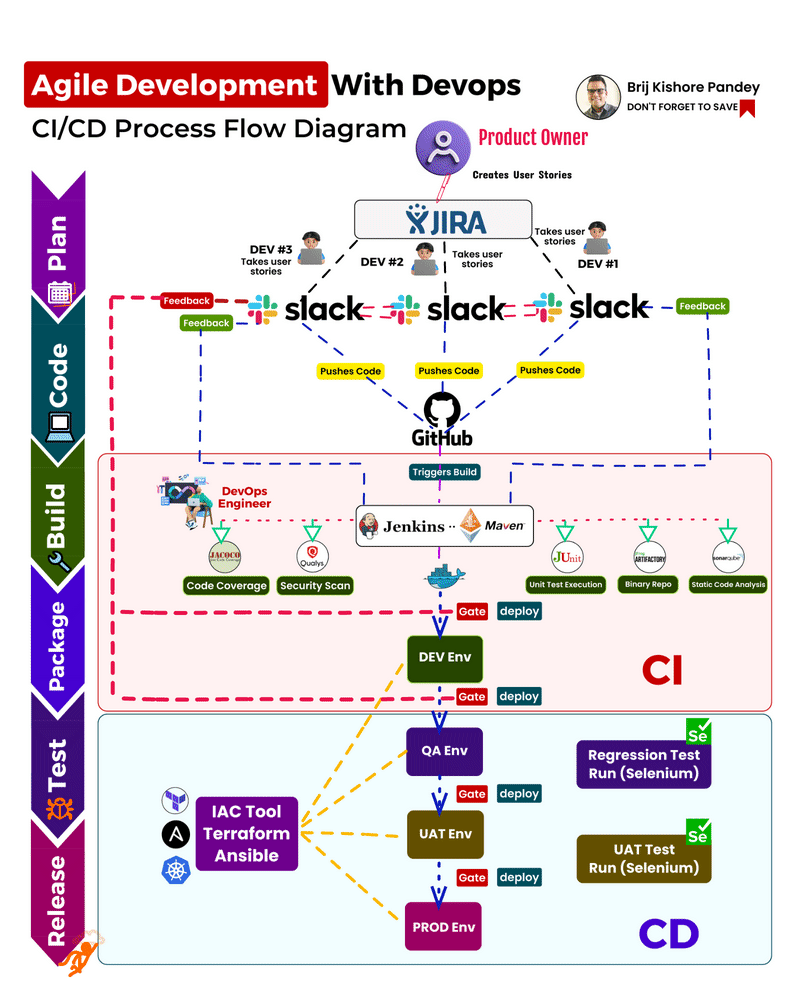

--

#### The DevOps Utopia: The tools: roadmap

- Setting up CICD does not have to be complex
- Go along the maturity of the team
- We are incepting the DevOps culture, try not to cause culture shock
- Start small: like how Ekipa and I do. We just use github and netlify
- Go enterprise: use tools seen in the periodic table.

--

#### The DevOps Utopia: The process

<video control width="100%" height="100%" autoplay=true loop=true>
  <source src ="videos/vid_git-workflow.webm"/>
</video>

--

#### The DevOps Utopia: The people

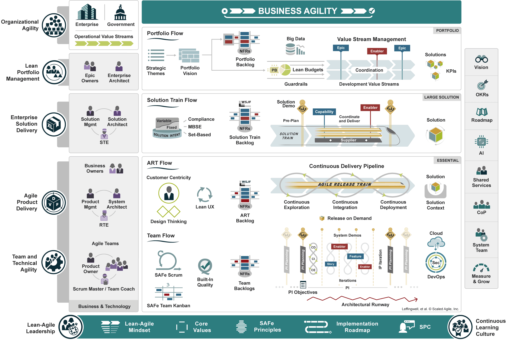

ref: [SAFe 6.0](https://scaledagileframework.com)

--

# The cult of DevOps

--

- what makes a good DevOps Engineer?
- how many DevOps should a team has?
- is the DevOps engineer also the infra engineer?

--

### DevOps Engineer

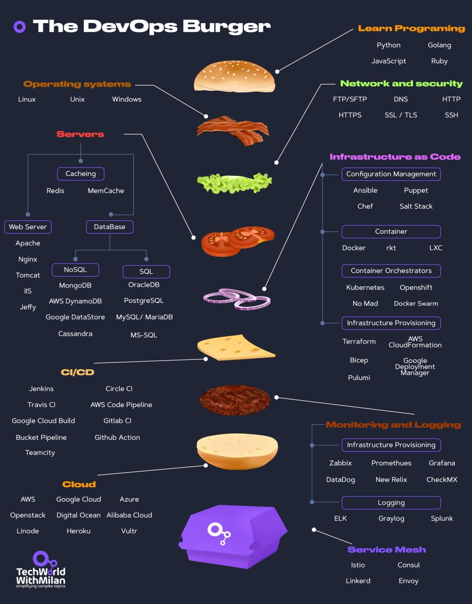

ref: [Dr. Milan Milanović (@milan_milanovic)](https://twitter.com/milan_milanovic/status/1684444624830464000?ref_src=twsrc%5Etfw)

--

### DevOps Engineer
- make fun of the devs
- also make fun of the ops (infra)
- devops can do both
- one day they may also have management skills

---

# Q&A

---

# Thank you

---

# Appendix

---

## If you hit this page, you already gone too far

--

### The Review Process

<table>
  <tr>
    <td>
      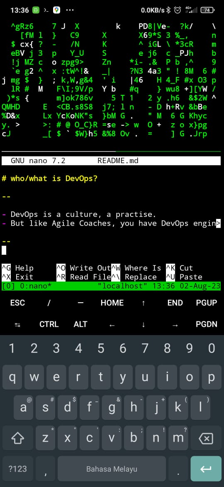
    </td>
    <td style='text-align:center; vertical-align:middle'>
      This is how my screen look like while writing this presentation.
    </td>
  </tr>
</table>

--

### The Review Process

<table>
  <tr>
    <td>
      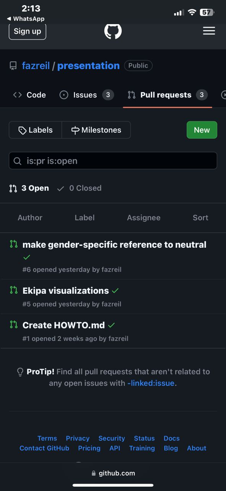
    </td>
    <td style='text-align:center; vertical-align:middle'>
      I received a request to change my presentation. So I quickly branch out and fix it in a branch.
    </td>
  </tr>
</table>

--

### The Review Process

<table>
  <tr>
    <td>
      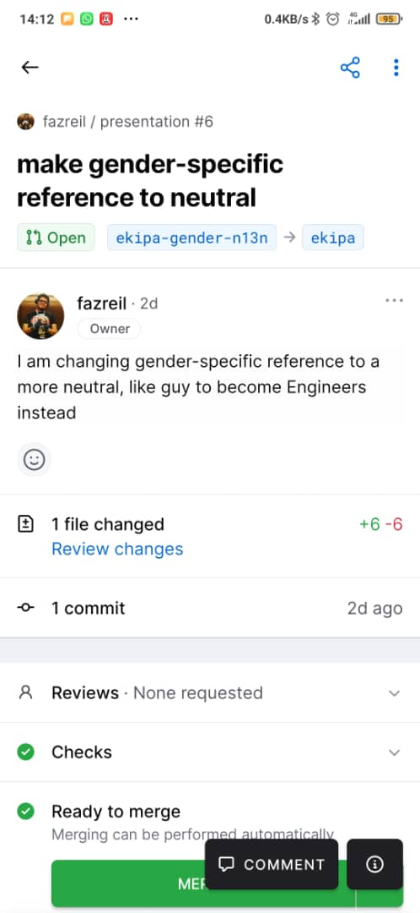
    </td>
    <td style='text-align:center; vertical-align:middle'>
      Then I ask to review my changes.
    </td>
  </tr>
</table>

--

### The Review Process

<table>
  <tr>
    <td>
      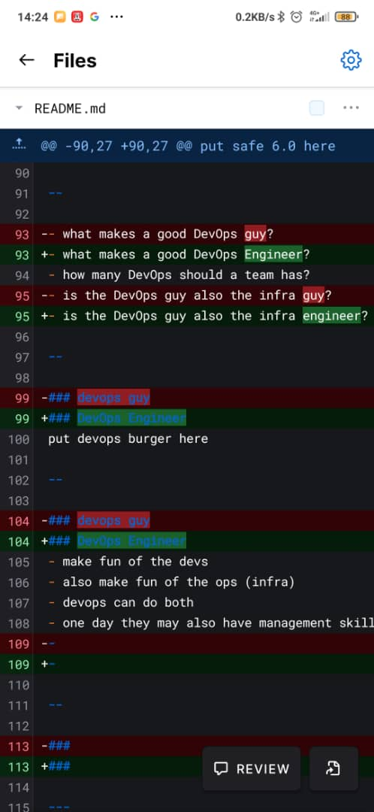
    </td>
    <td style='text-align:center; vertical-align:middle'>
      The reviewer can see where I changed.
    </td>
  </tr>
</table>

--

### The Review Process

<table>
  <tr>
    <td>
      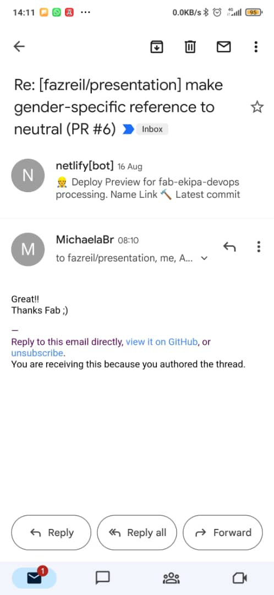
    </td>
    <td style='text-align:center; vertical-align:middle'>
      I get an email when Michaela commented, she seems satisfied.
    </td>
  </tr>
</table>

--

### The Review Process

<table>
  <tr>
    <td>
      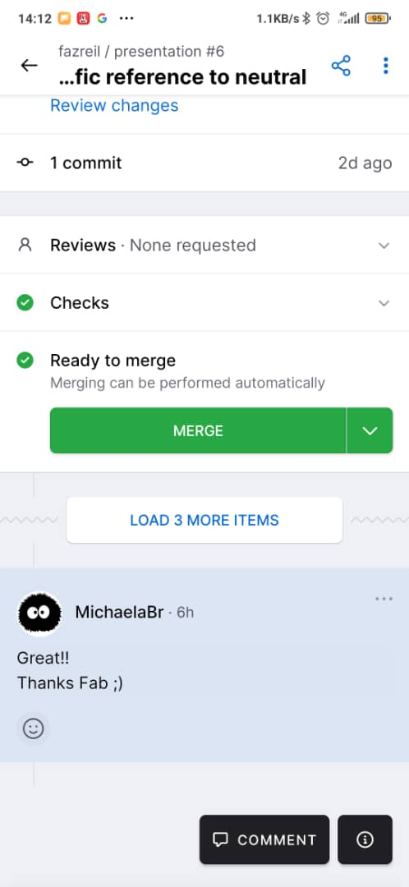
    </td>
    <td style='text-align:center; vertical-align:middle'>
      I click merge to bring my changes to the main branch.
    </td>
  </tr>
</table>  

--

### The Review Process

<table>
  <tr>
    <td>
      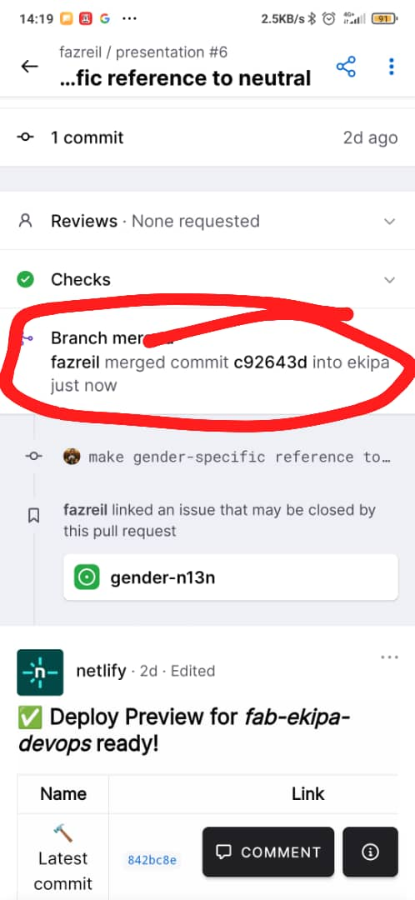
    </td>
    <td style='text-align:center; vertical-align:middle'>
      It says merged!
    </td>
  </tr>
</table>        

--

### The Review Process

<table>
  <tr>
    <td>
      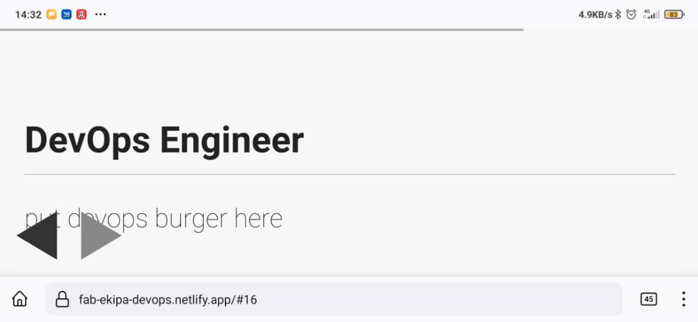
    </td>
  <tr/>
  <tr>
    <td style='text-align:center; vertical-align:middle'>
      And it gets reflected after it gets built.
    </td>
  </tr>
</table>  

--

### The Review Process

<table>
  <tr>
    <td>
      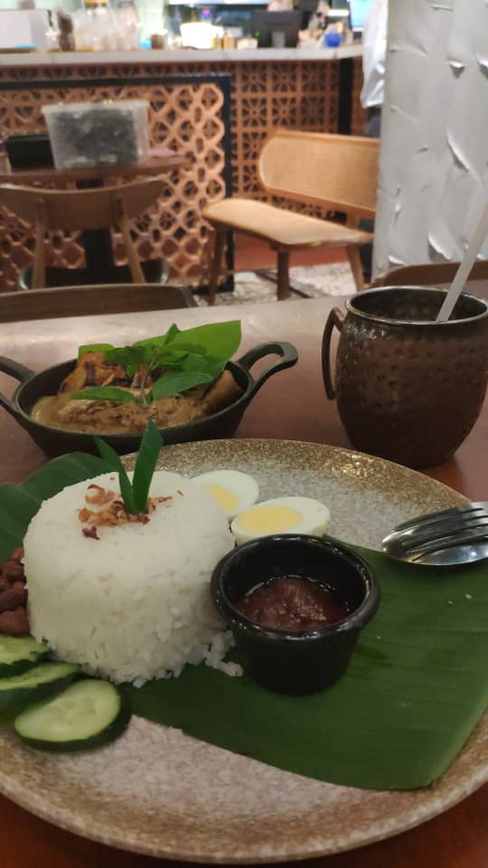
    </td>
    <td style='text-align:center; vertical-align:middle'>
      Then I can resume enjoying my lunch.
    </td>
  </tr>
</table>  

--
