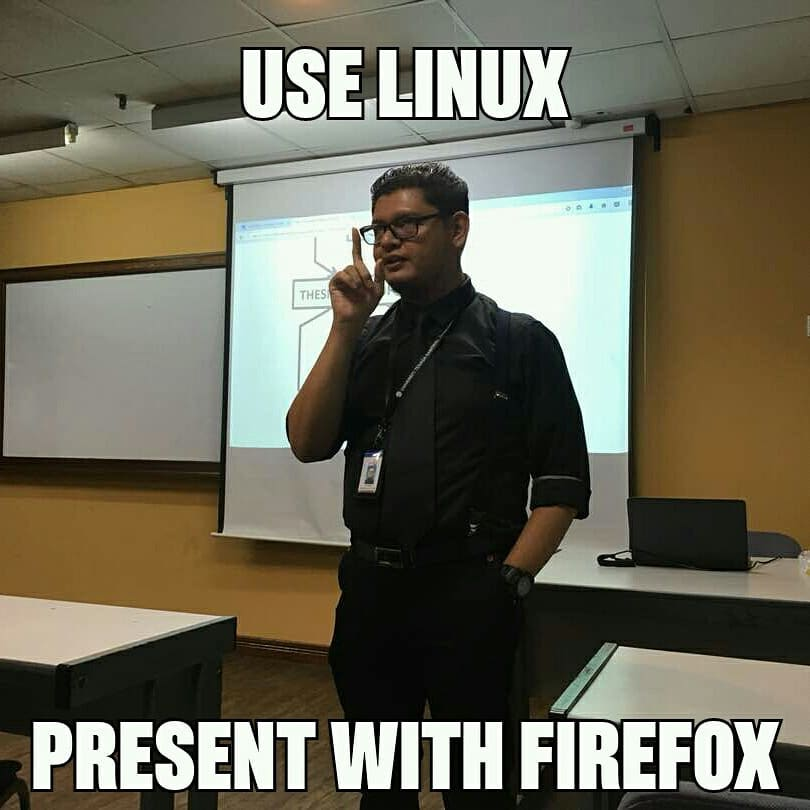

title: CICD
author:
  name: Fazreil Amreen
  twitter: fab52
  url: https://www.linkedin.com/in/ts-fazreil-amreen-abdul-jalil-a0259321
output: index.html
controls: true
theme: sudodoki/reveal-cleaver-theme

--

# CICD:
## The Agile Release ([Silver] Bullet) Train

--

### A little info about myself

- Name: Ts. Fazreil Amreen bin Abdul Jalil
- Nickname: Fab
- Casual Gamer, Build Engineer, Party Starter, Clever Joker, Competent Driver, Author, Certified Trainer, Configuration Manager, DevOps, Husband
- Current job: VP observing the implementation of DevOps at MIDF

--

--

# who/what is DevOps?

--

--

- DevOps is a culture, a practise.
- But like Agile Coaches, you have DevOps engineers to cultivate the culture.

--

# DevOps do what actually?

--

- Connect between Development and Operations
- Build pipeline
- Enhance build by probing it
- Shift left operations into development stage

---

# Pipeline Design

--

- How does the DevOps choose what program to use?
- How does the DevOps design the pipeline?
- What criteria does the DevOps have in mind when it comes to design the pipeline?
- Pipeline, what pipeline?

--

### The DevOps Periodic Table

I usually use this table to decide what to put in the pipeline

--

### Tools

<video control width="100%" height="100%" autoplay>
  <source src ="videos/tools.webm"/>
</video>

--

### Agile X DevOps

ref: [A Disciplined Approach to Adopting Agile Practices: The Agile Adoption Framework](https://www.researchgate.net/publication/225141527_A_Disciplined_Approach_to_Adopting_Agile_Practices_The_Agile_Adoption_Framework)

--

### The DevOps utopia

<video control width="100%" height="100%" autoplay>
  <source src ="videos/ppt.webm"/>
</video>

--

#### The DevOps Utopia: The tools

--

#### The DevOps Utopia: The process

<video control width="100%" height="100%" autoplay>
  <source src ="videos/vid_git-workflow.webm"/>
</video>

--

#### The DevOps Utopia: The people

ref: [SAFe 6.0](https://scaledagileframework.com)

--

# The cult of DevOps

--

- what makes a good DevOps Engineer?
- how many DevOps should a team has?
- is the DevOps guy also the infra engineer?

--

### DevOps Engineer

ref: [Dr. Milan Milanović (@milan_milanovic)](https://twitter.com/milan_milanovic/status/1684444624830464000?ref_src=twsrc%5Etfw)

--

### DevOps Engineer
- make fun of the devs
- also make fun of the ops (infra)
- devops can do both
- one day they may also have management skills

---

# Q&A

---

# Thank you
